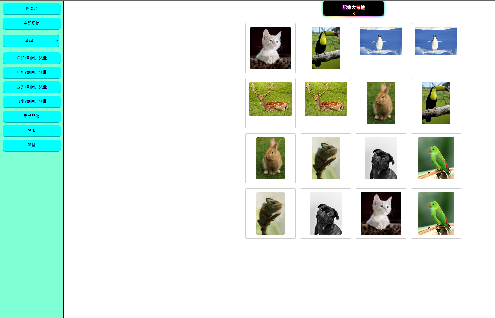

# 記憶大考驗

這是一個簡單的記憶遊戲，玩家需要翻轉卡片來找到匹配的圖案。遊戲支援調整格子大小和多組圖片，增加挑戰性。

## 遊戲截圖

 

## 功能特色

- **自適應設計**：可動態調整格子大小，有 2x2、4x4 和 6x6 三種選擇。
- **圖片選擇**：玩家可以在遊戲過程中切換不同的圖片組。
- **音效反饋**：當玩家成功匹配或錯誤翻牌時會有音效提示。
- **計時器**：遊戲內設有倒數計時器，增加緊迫感。
- **互動界面**：多個按鈕可以調整格子大小、翻牌和重啟遊戲。

## 遊戲玩法

1. 從下拉選單中選擇格子大小。
2. 點擊卡片進行翻面，找到匹配的對子。
3. 當所有對子都匹配完成時，遊戲結束。
4. 若成功，會顯示一個提示訊息以及花費的時間。

## 安裝方法

1. 複製此倉庫：
    ```bash
    git clone https://github.com/kulianpa7/1009-50915130.git
    ```
2. 在瀏覽器中打開 `index.html`。

## 檔案結構

- **index.html**: 頁面的主結構，包含側邊欄和遊戲格子。
- **main.js**: 記憶遊戲的邏輯，包括卡片翻轉、匹配邏輯以及音效處理。

## 依賴項

- **[jQuery](https://jquery.com/)**: 用於 DOM 操作和事件處理。
- **[SweetAlert2](https://sweetalert2.github.io/)**: 用於在玩家勝利時顯示自定義提示訊息。

## 自訂功能

- **格子大小**：通過選擇不同的選項（2x2, 4x4, 6x6）來修改格子大小。
- **圖片組切換**：使用「換圖片」按鈕在不同圖片組間切換。
- **其他控制**：
    - 「增加X軸圖片數量」和「增加Y軸圖片數量」可以增加列數和行數。
    - 「減少X軸圖片數量」和「減少Y軸圖片數量」可以減少列數和行數。
    - 「開牌」和「關排」按鈕用於翻開和重設所有卡片。
    - 「重新開始」按鈕可以根據當前設置重啟遊戲。

## 音效說明

當卡片翻面並成功匹配時，會播放音效：
- **success.mp3**: 當找到匹配的對子時播放。
- **fail.mp3**: 當翻轉的卡片不匹配時播放。

請確保音效檔案放置在與 HTML 和 JS 檔案相同的目錄下。

## 授權

本專案採用 MIT 授權。詳情請參見 [LICENSE](LICENSE) 文件。
